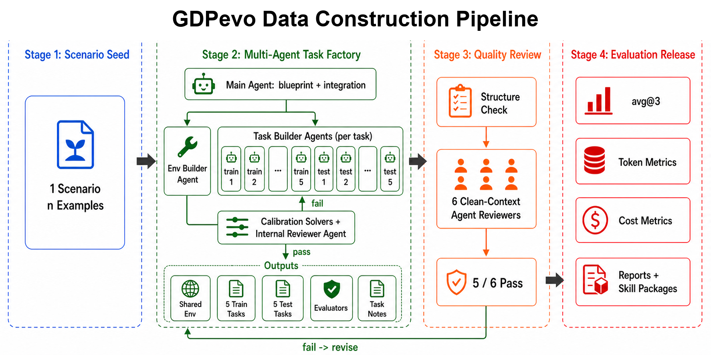
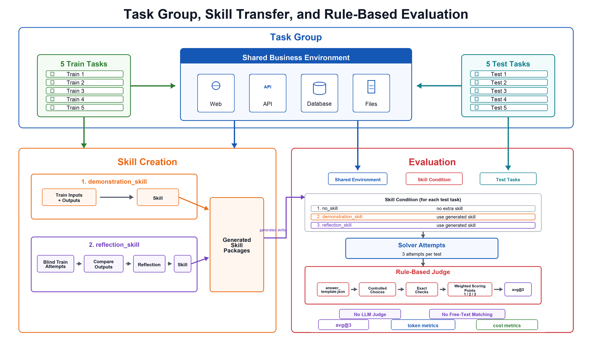

# GDPevo: Measuring Skill Transfer in Real Business Production Environments

GDPevo studies a gap left by task-completion benchmarks: whether agents can turn related training work into reusable skills for held-out tasks in the same business environment. The tasks are grounded in productivity-bearing office work: CRM handoffs, financial checks, HR decisions, procurement reviews, and operational analyses whose outputs resemble work that would otherwise consume human business effort.

## Abstract

Existing agent benchmarks have made substantial progress on realistic environments, tool use, and professional deliverables, but many still report performance at independent-task granularity. This leaves a practical capability under-specified: whether an agent can reuse procedures learned from related work, avoid rediscovering source precedence, exclusion rules, calculations, and schema discipline, and complete future business tasks more reliably. GDPevo evaluates this gap through task groups built from productivity-bearing business scenarios. Each task group contains one shared business environment, five train tasks, five held-out test tasks, reference answers, exact evaluators, and data notes. We evaluate three conditions: `no_skill`, where the solver receives only the test task and environment access; `demonstration_skill`, where a skill is derived from train inputs and outputs; and `reflection_skill`, where a skill is derived after blind train attempts, answer comparison, and reflection. The first released run covers 12 task groups, 60 train tasks, 60 test tasks, and 72 generated skill packages. On Codex GPT-5.5 xhigh, skill-conditioned runs improve average test performance over the no-skill baseline and reduce average token/cost usage, indicating that the benchmark captures a measurable form of task-family transfer in real business work.

## 1. Introduction

Current agent benchmarks leave three practical questions difficult to answer. First, can an agent reuse procedures across related tasks? Second, does that reuse improve held-out work in the same environment, where records, entities, constraints, and output requirements change? Third, when the tasks represent real productive business work, can this effect be measured with exact task scores and downstream cost signals, while preserving inspectable artifacts such as task notes and generated skills?

GDPevo turns these questions into a benchmark unit: the task group. A task group contains one shared business environment and a train/test split of related tasks. The solver may need to operate a web workspace, query an API or database, inspect business records, reconcile inconsistent files, understand domain rules, and return a JSON object or spreadsheet-like decision artifact. Because train and test tasks share an environment, the benchmark can measure whether prior work becomes a portable operating method across held-out tasks.

The name GDPevo reflects this measurement target. We are not only asking whether an agent can finish an isolated task. We are asking whether experience can evolve into reusable skill for recurring work in business production settings: more correct decisions, fewer wasted search steps, and lower marginal effort when similar work appears again. The resulting work products may be qualified account lists, finance reconciliation outputs, procurement review decisions, HR workflow judgments, or operational analysis artifacts.

The benchmark is designed around real business environments. A task group may expose a CRM web console, REST-style APIs, database tables, ERP-like records, finance reporting files, banking review workspaces, HR workflows, or operational analytics systems. The solver must complete long-horizon work through the environment interfaces made available for that task group, and the evaluator scores concrete business outcomes such as record sets, totals, rankings, classifications, dates, or structured action counts.

GDPevo makes three design commitments. First, tasks are grouped by environment so that transfer is measurable. Second, train tasks are real tasks whose reference materials do not directly expose the complete SOP or all decisive facts; useful skills should emerge from observing, attempting, comparing, and reflecting on prior work. Third, released artifacts are inspectable: task notes explain the problem definition, expected solution path, likely failure modes, and evaluation criteria, while generated skill packages expose what the skill-generation process actually produced.

## 2. Design Motivation and Benchmark Context

The benchmark is situated among several lines of recent agent evaluation. [GDPVal](https://openai.com/index/gdpval/) focuses on economically valuable real-world tasks, with tasks based on expert work products from real occupations rather than exam-style prompts. [tau2-bench](https://github.com/sierra-research/tau2-bench) studies domain simulations where an agent follows policies, uses tools, and interacts with a user simulator. [SOP-Bench](https://github.com/amazon-science/SOP-Bench) evaluates multi-step industrial procedures that require sequential reasoning, tool orchestration, and implicit operational knowledge. [SaaS-Bench](https://github.com/UniPat-AI/SaaS-Bench) evaluates computer-use agents in self-hosted SaaS applications and browser-driven business workflows. [Terminal-Bench](https://github.com/harbor-framework/terminal-bench) evaluates agents in real terminal environments through end-to-end system tasks. [JobBench](https://github.com/Job-Bench/job-bench-eval) focuses on tedious multi-source preprocessing work that professionals want offloaded, organized with working directories and weighted rubrics.

GDPevo takes a complementary angle: it asks whether a solver can use repeated experience within a business environment to form a reusable skill. This requires a different data unit. A single task cannot expose transfer; a leaderboard over unrelated tasks cannot tell whether an agent learned from prior examples. The natural unit is a task group: one environment, multiple train tasks, multiple test tasks, and a common family of transferable procedures.

This framing treats agent learning as a measurable change in future behavior. A rising success curve over independent samples can be useful for tracking general capability, but it does not isolate experience accumulation: task 101 may have no designed relation to task 100. In GDPevo, train tasks create an explicit source of prior experience, and held-out test tasks measure whether that experience changes subsequent solving. The benchmark therefore focuses on a concrete slice of self-improving agent behavior: task-family skill transfer under controlled skill-generation conditions.

The resulting benchmark targets two abilities at once:

1. Long-horizon execution in real business environments.
2. Skill transfer from train tasks to related held-out test tasks.

These two abilities interact. If tasks are too easy, skill transfer is uninformative because the no-skill baseline already solves them. If train and test are too far apart, skill generation becomes a weak hint rather than transferable experience. The construction pipeline therefore aims for a transfer band: tasks should share meaningful operating procedures while still requiring fresh exploration, task-specific data retrieval, and exact output construction.

The public results also track more than final accuracy. `avg@3` measures held-out task correctness, while token and cost metrics show whether a generated skill makes the solver more directed or merely shifts work into longer answer attempts. Because the task groups model work with productivity value, cost reduction is not just an implementation detail: it helps indicate whether a skill can make repeated business work cheaper to execute, while the primary score remains task correctness.

## 3. Data Construction Pipeline

GDPevo is produced through a staged pipeline. The pipeline begins from a compact scenario seed and ends with released task groups, evaluation reports, and generated skill packages. The construction process is deliberately multi-agent: different clean-context agents are responsible for environment construction, per-task authoring, calibration, internal review, and final quality review. This separation is meant to lower the risk that task answers, hidden SOPs, or overly simple shortcuts are silently baked into the benchmark.



**Figure 1.** Overview of the GDPevo data construction pipeline. A scenario seed is expanded into a task group by a multi-agent task factory, iteratively calibrated and reviewed, checked by clean-context reviewer agents, and released with evaluation metrics, reports, and generated skill packages.

### 3.1 Scenario Seed

The first stage prepares a scenario seed. A seed contains one scenario and `n` examples from real work or benchmark-like task backgrounds. The scenario defines the business setting and task family; the examples provide concrete work patterns and difficulty anchors. They may involve reconciling CRM records after an event, selecting valid prospects from a trade-show directory, cleaning contact imports, calculating financial control metrics, resolving support queues, or applying policy rules to HR or procurement cases.

At this stage, the seed mainly serves as a compact anchor for the task family and its difficulty profile. Later stages preserve those difficulty drivers while turning the seed into an executable, auditable task group.

### 3.2 Multi-agent Task Factory

The second stage expands the seed into a full task group. A main agent first writes the task-group blueprint and keeps responsibility for integration. The blueprint defines the shared environment, train/test coverage, transfer plan, expected task diversity, answer schemas, evaluator strategy, and the assignment of task builders.

The factory then separates construction into specialized agents:

- An environment-builder agent implements the shared `env/` as a business world rather than a set of per-task data packages.
- Task-builder agents work at task granularity. Each builder is responsible for one train or test task, including solver-visible input, reference answer, evaluator, and task notes.
- Calibration solvers test whether direct solving remains sufficiently difficult and whether train-derived skills can transfer without making test tasks trivial.
- An internal reviewer agent inspects the emerging task group for leakage, schema friction, weak scoring goals, environment shortcuts, and train/test mismatch.

The factory is iterative. If calibration solvers or the internal reviewer find that tasks are too easy, too disconnected, leaky, or poorly scored, the task builders revise the task and rerun the relevant checks. Only a passing iteration becomes the task-group output: one shared environment, five train tasks, five test tasks, exact evaluators, and explanatory task notes.

This division of labor is part of the data standard. The benchmark aims to evaluate skill transfer, so the construction process must avoid accidentally baking the full answer procedure into every prompt or environment endpoint. The shared environment should look like a public office system: it may expose web pages, APIs, database connections, or files, but it should not expose per-task answer-like endpoints or task-specific shortcuts.

### 3.3 Quality Review

The third stage is an independent quality review. A deterministic structure check first validates the file layout, answer templates, evaluators, and task group consistency. Then six clean-context agent reviewers independently inspect the task group against the review criteria. A task group passes only if the structure check passes and at least five of the six reviewers vote to pass.

Reviewers focus on benchmark quality rather than surface formatting. They check whether the task group is grounded in the scenario seed, whether train/test transfer is meaningful, whether diversity stays inside a transferable band, whether the environment boundary is realistic, whether solver-visible files leak answers, whether notes are explanatory, and whether evaluators score exact business outcomes. If fewer than five reviewers pass the task group, it returns to the task factory for revision and must be reviewed again.

### 3.4 Evaluation Release

The fourth stage releases the evaluation artifacts. For each accepted task group, an evaluation workspace runs the same held-out test tasks under three skill conditions: `no_skill`, `demonstration_skill`, and `reflection_skill`. The primary result is `avg@3`, and the release also records token metrics and board-level cost estimates. Structured reports are released together with the generated skill packages, so readers can inspect both the scores and the skills that influenced those scores.

## 4. Task Group Representation

A task group is the central data object in GDPevo. It contains one shared environment, five train tasks, five test tasks, and all evaluation materials needed to reproduce the score.



**Figure 2.** Task-group structure and evaluation protocol. Five train tasks and five test tasks share the same business environment. Skills are generated under demonstration and reflection conditions, and final answers are scored by deterministic rule-based evaluators.

The shared environment is what distinguishes a task group from a collection of independent prompts. It forces the solver to operate in a persistent business world: the same accounts, events, policies, invoices, tickets, employees, vendors, or records may appear across tasks. This creates the possibility of reusable procedural knowledge.

Each formal task has the following structure:

| Component | Role |
| --- | --- |
| `input/` | Solver-visible prompt, payloads, and answer template. |
| `output/answer.json` | Reference answer used by the evaluator. |
| `eval/` | Task-specific exact evaluator. |
| `notes/notes.md` | Human-readable explanation of task definition, solution method, failure modes, and scoring criteria. |

The train and test tasks are drawn from the same real-task distribution. Train tasks are earlier samples from the task family, but their reference materials do not directly expose the full SOP or all decisive facts. The solver or skill-generation agent must infer the useful procedure from the same kind of work that will later appear in test tasks. Test tasks change records, entities, constraints, and sometimes output shape, so a skill can guide the solver but cannot replace task-specific exploration.

## 5. Skill Conditions

GDPevo evaluates three conditions:

| Condition | Information available to the test solver | Purpose |
| --- | --- | --- |
| `no_skill` | Test task input and allowed environment access. | Measures cold-start performance. |
| `demonstration_skill` | Test task input, environment access, and a skill generated from train inputs and outputs. | Tests whether input/output demonstrations reveal a reusable procedure. |
| `reflection_skill` | Test task input, environment access, and a skill generated after blind train attempts, answer comparison, and reflection. | Tests whether experience and error correction produce a better operating method. |

## 6. Evaluation Protocol and Workspace

The primary metric for a task group is `avg@3`. For each skill condition, the evaluation runs the five held-out test tasks, with three independent solver attempts per test task. The task-group `avg@3` is the average score over those test attempts for the current condition:

```text
task_group_avg@3 = mean(score over 5 test tasks x 3 attempts)
```

Public tables report `avg@3` as a percentage.

Every solver attempt is context-clean. The solver receives only the current test task input, the allowed environment access instructions, and the skill file for the current condition if one exists. The main evaluation agent starts or prepares the environment, stages the minimal workspace for each solver, launches clean-context subagents, calls evaluators after answers are written, and aggregates results.

The evaluation workspace also records solver-side token metrics for the same answer-writing attempts. Reports track cached input tokens, input tokens, and output tokens; public tables display these token counts in thousands (`k`). Skill generation, environment startup, evaluator execution, and main-agent aggregation are excluded from these token metrics.

Scoring is exact and task-specific. Evaluators are designed around business outcomes: sets of qualified records, exclusion reasons, totals, dates, rankings, classifications, action counts, or required JSON fields. This choice makes evaluation more interpretable than free-form judging. When an agent fails, the missed points usually correspond to a concrete retrieval, reasoning, normalization, calculation, or schema failure.

## 7. Rule-Based Judging and Rubric Design

GDPevo uses rule-based evaluators rather than LLM-as-judge scoring. This choice is central to the benchmark. The tasks often require exact business outcomes: the correct set of qualified accounts, the correct exclusion reasons, the correct invoice status, a total at a specified precision, a ranked list, a due date, or a required JSON field. In these settings, a probabilistic judge can introduce two unwanted sources of variance. It may disagree about whether a semantically similar answer deserves credit, and it may penalize or forgive incidental formatting differences in ways that are hard to reproduce.

We therefore constrain outputs before scoring. Every task provides a solver-visible `answer_template.json` that defines the expected JSON shape, field types, numeric precision, list structure, stable identifiers, and allowed choices. When a scored result would otherwise be an open-ended string, we convert it into a controlled-choice field wherever possible. For example, a CRM exclusion reason is not judged by free-form sentence similarity; it is represented as an enum such as `sponsor_attendee`, `existing_disqualified`, `inactive_sponsor_record`, or `non_business_badge`. This design reduces accidental format loss while preserving the underlying business judgment.

Each task is scored by several business-result checks. A scoring point is not meant to be a tiny syntax field; it should correspond to a meaningful outcome such as a full sponsor-status set, a revenue aggregate, a qualified lead set, an exclusion list, a follow-up schedule, or an action-count summary. The raw weight of each scoring point is restricted to `1`, `2`, or `3`, and the final contribution is normalized by the sum of all raw weights:

```text
score(point_i) = weight_i / sum_j(weight_j)
```

if the rule check passes, and `0` otherwise. This keeps rubric design simple enough to audit while still allowing important business outcomes to receive more weight. Higher-weight points are reserved for checks that require real data exploration, source reconciliation, long-horizon reasoning, or transfer from train-task experience. Low-level properties such as JSON parseability or field presence may be prerequisites, but they should not dominate the score.

Rule-based judging also improves error analysis. Because each point is implemented as deterministic code, a failed attempt can be traced to a concrete mismatch: a missing record, a wrong enum, an incorrect total, a misordered ranking, or a violated normalization rule. This makes benchmark results easier to reproduce and easier to debug than a single holistic text judgment.

## 8. Case Study: SCN_001 CRM Marketing Lead Capture

`SCN_001_crm_marketing_lead_capture` illustrates the design. The scenario covers the front end of CRM marketing operations: events, sponsorships, trade shows, contact capture, import hygiene, campaign membership, and sales follow-up. The source examples combine three business patterns:

1. Event sponsorship and CRM handoff: distinguish sponsors from ordinary attendees, align sponsorship status with invoices and payments, and generate follow-up actions.
2. Trade-show prospecting: identify qualified manufacturers or OEMs from an exhibitor directory while excluding resellers, service providers, and adjacent non-target companies.
3. Contact import hygiene: normalize emails and phone numbers, remove unreachable contacts, handle suppression lists, and deduplicate records before CRM import.

The constructed task group builds a shared HarborCRM environment. HarborCRM exposes event metadata, sponsor packages, finance invoices, badge scans, CRM accounts, contacts, opportunities, campaign members, trade shows, exhibitors, meeting interest records, import batches, raw contacts, suppression lists, and policy summaries through public API endpoints. The environment also contains distractor records and near-miss entities, making it necessary to identify the correct event, show, or import batch before solving.

The five train and five test tasks are organized around three transferable operation families. Event handoff tasks require joining event, sponsor, finance, CRM, and badge data; trade-show tasks require controlled prospect qualification and exclusion reasoning; import hygiene tasks require normalization, suppression, and deduplication. The test tasks reuse these procedures under changed records and output demands. A good skill should therefore help with source precedence, qualification rules, date calculations, deduplication policy, and JSON schema discipline, but it should not contain the test answers.

This case shows why a shared environment matters. If each task shipped as an isolated file bundle, the solver could treat it as a one-off extraction problem. In HarborCRM, the solver must learn how the business world is organized: where event orders live, how finance invoices change sponsor status, how CRM account state affects lead qualification, how exhibitor descriptions map to platform categories, and how suppression policy constrains imports. Skill transfer becomes measurable because train and test tasks share this operational substrate.

In the initial public run, `task_group_001` improves from 44.43% under `no_skill` to 48.12% with `demonstration_skill` and 57.46% with `reflection_skill`. The gain is not simply a format effect; the strongest improvement comes from procedural knowledge that helps the solver avoid repeated mistakes in sponsorship status, exclusion logic, and CRM action counting.

## 9. Released Results

The first public run evaluates Codex GPT-5.5 xhigh across 12 task groups. Both skill conditions improve over the cold-start baseline. We also report solver-side token metrics and estimated text-token cost. These numbers exclude skill generation, environment startup, evaluator execution, and main-agent summarization.

| Condition | Overall avg@3 (%) | Cached tokens avg@3 (k) | Input tokens avg@3 (k) | Output tokens avg@3 (k) | Cost USD avg@3 |
| --- | ---: | ---: | ---: | ---: | ---: |
| `no_skill` | 48.35% | 642.2k | 709.2k | 14.1k | 1.08 |
| `demonstration_skill` | 65.99% | 413.7k | 466.1k | 11.5k | 0.81 |
| `reflection_skill` | 67.13% | 409.1k | 458.7k | 11.3k | 0.79 |

`demonstration_skill` improves average performance by +17.64 percentage points over `no_skill`; `reflection_skill` improves it by +18.78 percentage points. The largest observed improvement appears in `task_group_009`, where `demonstration_skill` rises from 42.76% to 92.47%. At the same time, skill-conditioned solving is cheaper on average. Relative to `no_skill`, `demonstration_skill` reduces total input tokens by 34.3%, output tokens by 19.0%, and cost by 24.8%. `reflection_skill` reduces total input tokens by 35.3%, output tokens by 20.1%, and cost by 26.7%. Cost decreases in 11 of 12 task groups under `demonstration_skill` and in 12 of 12 task groups under `reflection_skill`.

These results suggest that train-derived skills can materially improve held-out business task performance while often reducing redundant environment exploration. The token and cost results extend that conclusion: skill use is not merely buying accuracy with longer reasoning. In this run, the skill conditions usually make the solver more directed, lowering token usage even though the solver is attempting more informed work. For productivity-bearing tasks, this combination matters: a useful skill should raise the quality of the business result and reduce the amount of downstream computation needed to produce it.

The result table should be read as an analysis surface rather than only a leaderboard. Some task groups benefit more from demonstrations, because the input/output pairs directly reveal the recurring rule. Others benefit more from reflection, because the useful procedure becomes clearer after the agent makes and diagnoses mistakes. Still others show modest gains, indicating either a strong no-skill baseline, weak train/test transfer, or generated skills that fail to capture the decisive operation.

## 10. Discussion

GDPevo frames agent learning as an operational workflow. A model does not merely answer a prompt; it interacts with an environment, writes answers, receives structured feedback through train outputs, distills a skill, and then attempts related held-out work. This framing makes several phenomena visible.

First, skill transfer is task-family dependent. A skill that encodes source precedence, normalization, or eligibility criteria can sharply improve performance when the same procedure recurs. A skill that only restates generic advice may add little. Second, environment design matters. Transfer is meaningful only when train and test share a real operational substrate rather than a superficial theme. Third, exact evaluators are essential. Without concrete business scoring points, it is difficult to tell whether a skill improved correctness, reduced exploration, or merely changed the style of the answer.

The benchmark also highlights a useful tension. The best task groups are neither too homogeneous nor too diverse. If train and test are almost identical, the benchmark measures memorization. If they are unrelated, it measures general reasoning rather than skill transfer. The transfer band is where the benchmark becomes informative: the solver must reuse procedure while still doing fresh work.
